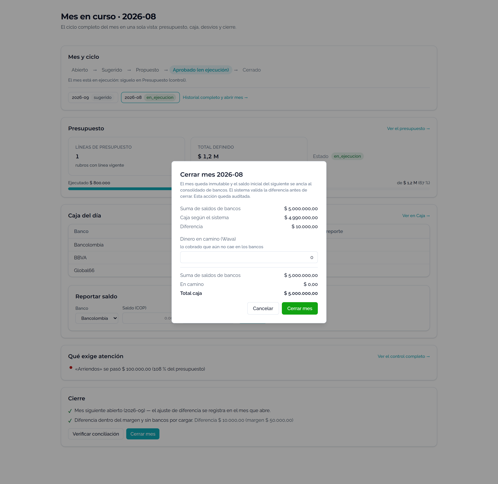
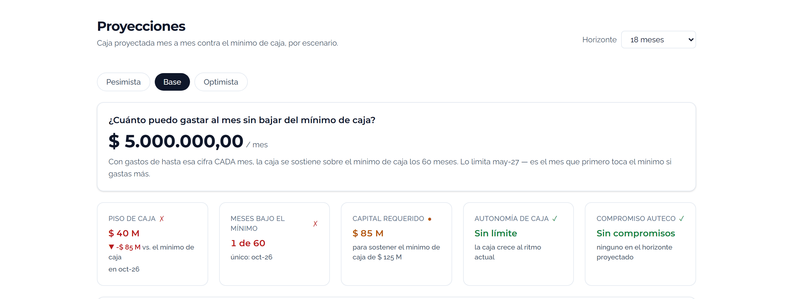

# EVIDENCIA — COPYS UX (español de negocio)

Rama `feat/copys-ux-negocio` sobre `main`. commit `e0c39fe`. PR #76.

## 1. Verificación (exacta)

```
$ npx vitest run
Test Files  45 passed (45)
     Tests  248 passed (248)

$ npm run build
✓ built in 3.49s        (solo warning preexistente de chunk >500 kB; no error)

$ npm run lint   (= biome check .)
Checked 140 files. No fixes applied.        (limpio)
```

## 2. Alcance del diff — solo texto visible (revisado por el coordinador)

```
$ git diff --stat            → 29 archivos, +133 / -112, todos en frontend/src
$ git diff | grep -iE 'umbral=|const umbral|conc\.umbral|dentro_de_umbral|distancia_al_umbral'
  (vacío — ninguna variable/prop/clave cambió; solo etiquetas de texto)
```

Sin backend, sin `lib/*`, sin dinero, sin histórico. Solo `components/` y `pages/`.

### Ejemplo crítico — conciliación NO se mapeó a "mínimo de caja"

```
- Conciliación dentro del umbral y sin bancos sin dato.
+ Diferencia dentro del margen y sin bancos por cargar.
- Diferencia {formatCOP(conc.diferencia)} (umbral {" "}      →  (margen {" "}   [variable conc.umbral intacta]
- Cuadra (dentro del umbral)                                 →  Cuadra (dentro del margen)
- label="Umbral"  (tolerancia al cierre)                     →  label="Margen"
```

## 3. Tabla de clasificación de "umbral" por sentido (precisión obligatoria)

### A) Sentido PISO DE CAJA → «mínimo de caja» (barrido A/B; líneas del estado pre-cambio)

| Archivo:línea | Texto original |
|---|---|
| ProyeccionPage.tsx:98 / :213 / :234 / :285 | "contra el umbral" / "vs. el umbral" / "para sostener el umbral de…" / "sobre el umbral en todo el horizonte" |
| InicioPage.tsx:161 / :182 / :210 | KPIs + conclusión |
| ReportesPage.tsx:115 / :132 / :151 / :182 | idem |
| ScenariosPage.tsx:196 | "vs. el umbral" |
| DatosPage.tsx:82 / :86 / :122 / :883 | "① Caja y umbral" / "Umbral (caja mínima)" / "El umbral del norte" / "El umbral quedó…" |
| DatosPage.tsx:89 | "…lo marca como perforación" → "una baja del mínimo de caja" (barrido B) |
| Tornado.tsx:52 | "¿Qué mueve mi umbral?" |
| TechoGastoCard.tsx:28 / :39 / :41 / :51 | "sin perforar el umbral" / "sobre el umbral" / "tocaría el umbral" / "sin perforar el umbral" |
| VallesCard.tsx:57 | "perfora el umbral" → "baja del mínimo de caja" |
| CashCurve.tsx:85 (`<title>`) / :169 (etiqueta) | "vs. umbral" / "— Umbral" |
| ScenariosChart.tsx:96 (`<title>`) / :176 (etiqueta) | idem |
| ComposicionCaja.tsx:144 (`<title>`) / :286 / :355 / :397 | "…y umbral abajo" / "umbral" / "perfora el umbral" / label "Umbral" |
| PanelDecisiones.tsx:517 / :525 | "baje del umbral" / "sin perforar" → "sin bajar del mínimo de caja" |

### B) Sentido CONCILIACIÓN / TOLERANCIA → «margen» (item 9; NO "mínimo de caja")

| Archivo:línea | Original → nuevo |
|---|---|
| CabinaMesPage.tsx:479 | "Conciliación dentro del umbral y sin bancos sin dato." → "Diferencia dentro del margen y sin bancos por cargar." |
| CabinaMesPage.tsx:483 | "(umbral {conc.umbral})" → "(margen {conc.umbral})" |
| ReporteCajaCard.tsx:198 | "Cuadra (dentro del umbral)" → "Cuadra (dentro del margen)" |
| ReporteCajaCard.tsx:228 | label "Umbral" (tolerancia al cierre) → "Margen" |

### C) OTROS / NO TOCADOS (por diseño)

- **aria-labels no visibles**: CashCurve.tsx:83, ScenariosChart.tsx:94, ComposicionCaja.tsx:141 — siguen "umbral" (no son texto visible en pantalla).
- **Identificadores / props / valores de dato**: `conc.umbral`, `dentro_de_umbral`, `distancia_al_umbral`, prop `umbral={…}`, `FlujoDiarioPage.tsx:151 umbral="0"`, `DatosPage.tsx:879/881 const umbral`, y libs (`caja.ts`, `egreso.ts`, `decisiones.ts`, `proyeccion.ts`, `parametros.ts`, `money.ts`, `cierre.ts`) — **sin cambio**.
- **Comentarios de código**: múltiples, no visibles.
- **TERCER sentido (DIAN)**: `QueExigeAtencion` "dispara con el umbral (+15 pts)" = umbral de *puntaje del calendario DIAN*, distinto de piso y de conciliación. Solo en comentarios/nombres de test (`QueExigeAtencion.test.tsx`); **sin string visible en producción** → nada que cambiar.

### Decisiones de criterio (para revisión del gate)

- "Runway"→«Autonomía de caja» + "al ritmo de gasto actual" extendido a `ReportesPage` (el item 2 solo citaba ProyeccionPage) para no dejar el término inglés inconsistente entre vistas.
- Conciliación→«margen» extendido a `ReporteCajaCard` (no estaba en la lista puntual) por ser el mismo concepto del item 9; mapearlo a "mínimo de caja" habría sido un bug semántico.
- Item 5: tooltip de Provisión simplificado de "Reserva contable informativa (P&G/NIIF 9)." a "Reserva contable informativa." para quitar la jerga NIIF, coherente con el nuevo label.

## 4. Capturas reales (Playwright) — requisito (d) del gate

<!-- CAPTURAS: embebidas abajo por el harness -->





## 5. CI (PR #76)

```
frontend (biome check .)   PASS
backend-real-mongo         PASS
gitleaks / pip-audit / runtime-imports / Vercel   PASS
backend                    (no es required check; confirmado aparte)
```
