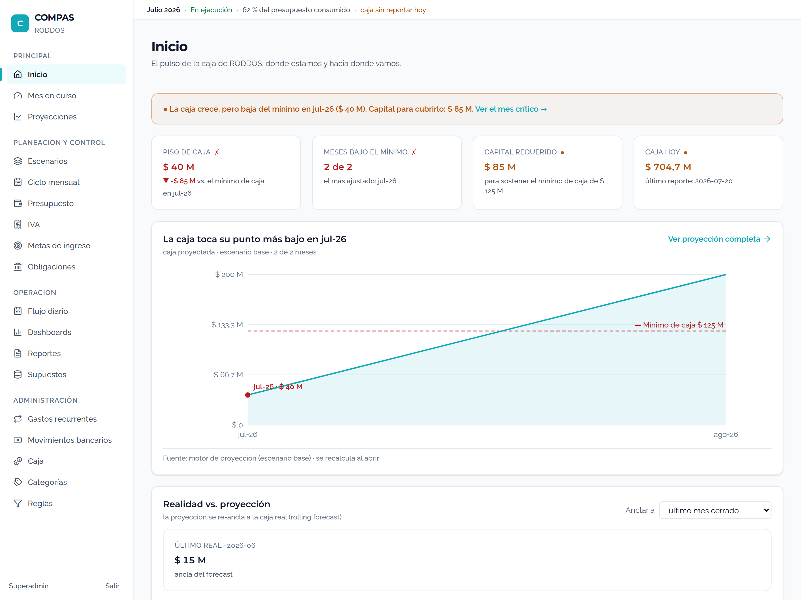

# EVIDENCIA — LOTE DEPENDABOT (#10–19)

Todos los merges en `main`. Cada PR rebasado sobre main actual antes de mergear; CI completo verde por PR (backend confirmado aparte, no es required check aún).

## 1. Merges (squash) y CI

| # | sha | CI (jobs verdes) |
|---|-----|------------------|
| #14 fastapi 0.141.1 | 36bbbac | backend 8m45s, real-mongo, frontend, pip-audit, gitleaks, runtime-imports, Vercel |
| #10 uvicorn 0.52.1 | b806073 | 7/7 verde |
| #16 sentry-sdk ≥2.66.1 | e664070 | 7/7 verde |
| #13 apscheduler 3.11.3 | 12493c6 | 7/7 verde |
| #12 lucide-react 1.29 | 7ea7f29 | 7/7 verde + build/tsc (21 iconos) + vitest 248 |
| #17 @types/node 26 | 4ab8845 | 7/7 verde (build/tsc) |
| #77 jsdom 29.1.1 (manual) | f1a119c | 7/7 verde EN NODE 20 (frontend corre vitest) |
| #78 typescript 7.0.2 (manual) | 4b26437 | 7/7 verde EN NODE 20 (build tsc7) |

## 2. fastapi 0.137 — el único breaking relevante NO nos afecta

```
$ grep -rnE '\.routes\b|for .* in .*\.routes' backend/app --include=*.py
  (solo llamadas include_router(); NINGUNA iteración de .routes)
```
0.137 cambió `router.routes` de lista plana a árbol; no dependemos de esa iteración.

## 3. jsdom — causa raíz demostrada (incompat Node 20)

```
jsdom 30 engines : node ^22.22.2 || ^24.15.0 || >=26.0.0   → EXCLUYE Node 20
jsdom 29.1.1     : node ^20.19.0 || ^22.13.0 || >=24.0.0   → soporta Node 20
CI frontend      : node-version "20"  (.github/workflows)
```
Con jsdom 30 en Node 20: `TypeError: webidl.util.markAsUncloneable is not a function` → 45 archivos de test fallan. Reproducido en el CI de #19 (run 31339680930). jsdom 29.1.1: vitest 248/248 en Node 20 (CI #77 verde).

## 4. TypeScript 7 — un solo breaking

```
$ tsc 7.0.2 build → error TS5102: Option 'baseUrl' has been removed.
```
Fix: quitar `baseUrl` de `tsconfig.app.json`; `paths: {"@/*":["./src/*"]}` es relativo → resuelve los 459 imports `@/` sin baseUrl. build (tsc7+vite) + vitest 248 + biome verdes (local y CI Node 20).

## 5. biome — por qué se saltó (evidencia del bug del migrate)

```
$ biome migrate --write   →   "rules": { "recommended": true }  ⇒  "rules": { "preset": "none" }
schema PresetConfig enum  =   ["recommended","all","none"]
```
`preset: "none"` **desactiva todas las reglas**; lo correcto sería `preset: "recommended"`. Además el schema 2.x rompe `files.ignore` y `useIgnoreFile` (exige .gitignore en la carpeta), y con la config corregida biome 2.x reformatea 29 archivos + 5-6 lint nuevos (noImportantStyles×3, noArrayIndexKey, noUselessFragments). Decisión CEO: quedarse en 1.9.4 (dev-only, funciona), major ignorado.

## 6. cryptography — obsoleto

```
$ git show main:backend/requirements.txt | grep cryptography
cryptography==50.0.0  # CVE-2026-69247/69248/69249 (fix 2026-08-03)
```
El PR #11 (→49) es un downgrade respecto a 50. No se merjea.

## 7. Capturas lucide (antes/después) — iconos idénticos




18 iconos del sidebar + ArrowRight: pixel a pixel iguales; ninguno roto ni desaparecido.
