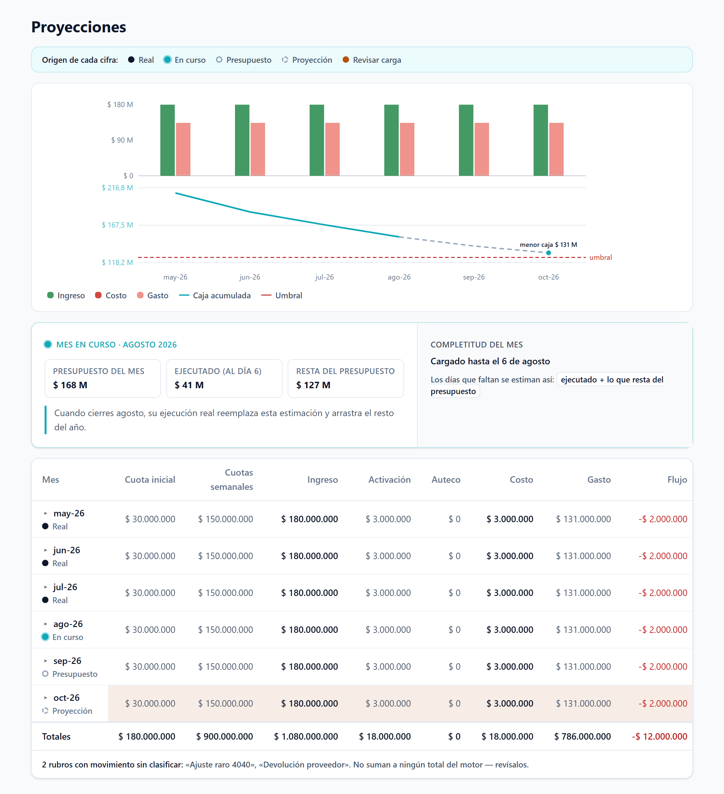
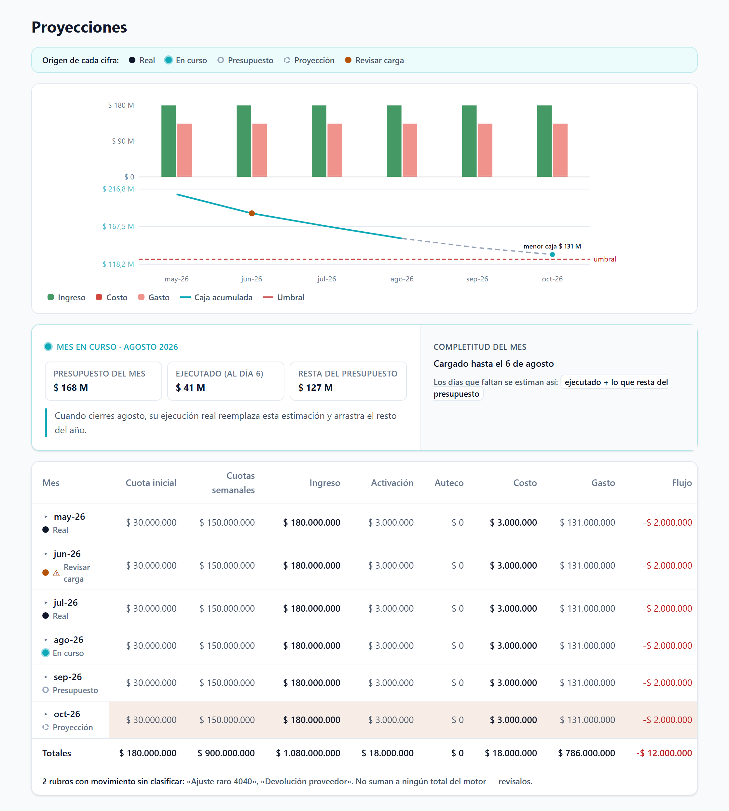
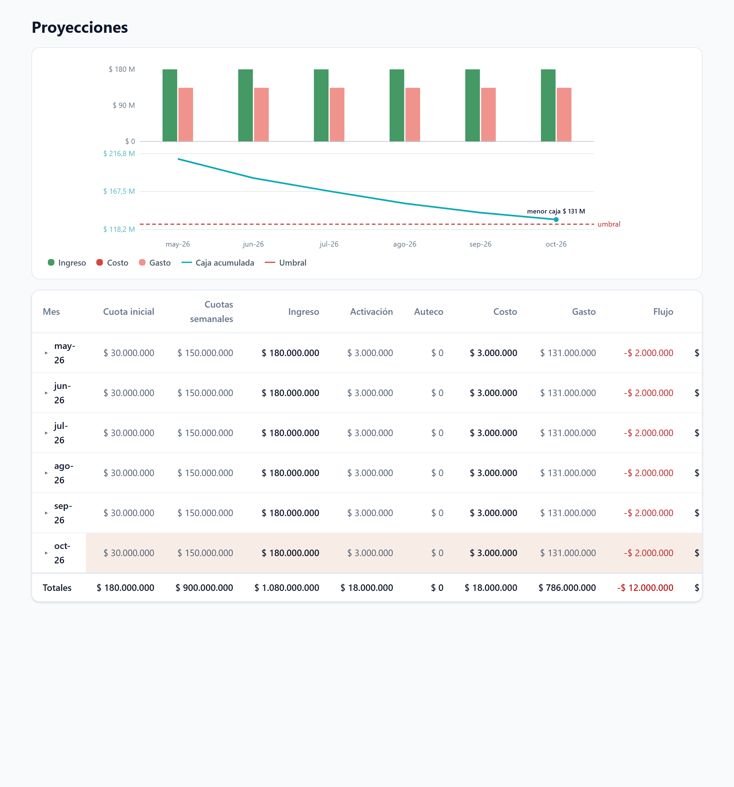

# EVIDENCIA — E1 PR6-I (frontend + ampliación P6-b)

Rama `feat/e1-p6-frontend-marcas` sobre `main`. Capturas reales de la página implementada
(componentes reales + `index.css` real, tokens cyan/semáforo, Raleway/Montserrat) + salidas.

## 1. Capturas reales de la página implementada (exigencia del gate)

### 1.1 — Con ejecución (marcas de origen + callout del mes en curso + sin_mapear)



Leyenda de origen; curva de caja **sólida** (may→ago, real/en curso) → **punteada** (ago→oct,
proyección); callout: Presupuesto $168 M · Ejecutado (al día 6) $41 M · Resta del presupuesto
$127 M + "Cargado hasta el 6 de agosto" + fórmula de negocio + arrastre; tabla con marca por mes
(Real · En curso · Presupuesto · Proyección); aviso `sin_mapear` al pie.

### 1.2 — Mes sospechoso (Revisar carga)



Junio marcado `cerrado_sospechoso`: punto **ámbar** en el gráfico + "⚠ Revisar carga" en la tabla.
Se ancla igual (solo se marca).

### 1.3 — Sin ciclo (candado: idéntica a hoy)



Sin `meses_anclados`: sin leyenda, sin callout, **sin marca bajo el mes**, **una sola línea** de
caja. La vista queda como antes de P6 (candado verificado).

## 2. Tests

### 2.1 Frontend (vitest)

```
$ npx vitest run
Test Files  45 passed (45)
     Tests  248 passed (248)
```

Nuevos de P6: `MarcaOrigen` 2 · `MesEnCursoCallout` 4 · `TablaEgreso` +3 (marca, sin_mapear,
candado) · `ComposicionCaja` +3 (1 línea sin anclaje, 2 tramos con anclaje, punto sospechoso) ·
`ProyeccionPage` +2 (con ciclo muestra leyenda/callout; sin ciclo no).

### 2.2 build + biome

```
$ npm run build        → tsc -b + vite build OK (✓ built)
$ npx biome check src  → Checked 132 files. (sin errores)
```

### 2.3 Backend (ampliación P6-b: ejecutado + proyectado en cargar_completitud_mes_en_curso)

```
$ python -m pytest -q
910 passed, 95 skipped, 0 fallos
```

TDD del helper: mongomock (`test_completitud_mes_en_curso_toma_la_fecha_maxima` asevera
`ejecutado="30.00"`, `proyectado="100.00"`) + real-mongo (`ejecutado="21.00"`,
`proyectado="50.00"`). ruff limpio.

## 3. R0 / perímetro

```
$ git diff --stat origin/main -- backend/app/proyeccion/motor.py
   (vacío — motor.py CERO diffs)
```

`anclar`/`lectura.py`/`reconciliacion.py` sin tocar. El único cambio backend es aditivo en el
helper de P5 (`loader.py`, +9 líneas: 2 sumas planas).

## 4. Diff (resumen)

```
 backend/app/proyeccion/ejecucion/loader.py         |   9 ++
 frontend/src/components/charts/ComposicionCaja.tsx | 59 +++++++++-
 frontend/src/components/charts/ComposicionCaja.test.tsx | 31 ++++
 frontend/src/components/proyeccion/MarcaOrigen.tsx | 82 +++++++++++
 frontend/src/components/proyeccion/MarcaOrigen.test.tsx | 28 +++
 frontend/src/components/proyeccion/MesEnCursoCallout.tsx | 104 +++++++++++
 frontend/src/components/proyeccion/MesEnCursoCallout.test.tsx | 59 ++++
 frontend/src/components/proyeccion/TablaEgreso.tsx | 34 ++-
 frontend/src/components/proyeccion/TablaEgreso.test.tsx | 54 ++++
 frontend/src/lib/proyeccion.ts                     | 22 ++
 frontend/src/pages/ProyeccionPage.tsx              | 13 +
 frontend/src/pages/ProyeccionPage.test.tsx         | 38 ++
 12 files changed, 525 insertions(+), 8 deletions(-)
```

## 5. TDD rojo→verde (por pieza)

1. `MarcaOrigen` — RED (módulo no resuelto) → GREEN (2).
2. `cargar_completitud_mes_en_curso` ejecutado/proyectado — RED (AssertionError dict) → GREEN.
3. `MesEnCursoCallout` — RED → GREEN (4; ajuste de copy "Resta del presupuesto" por honestidad R5).
4. `TablaEgreso` marca + sin_mapear — RED (props/textos) → GREEN; candado (marca solo con ciclo) RED→GREEN.
5. `ComposicionCaja` split — RED (1 vs 2 polilíneas / punto) → GREEN.
6. `ProyeccionPage` cableado — RED (leyenda/callout ausentes) → GREEN; candado verde.
